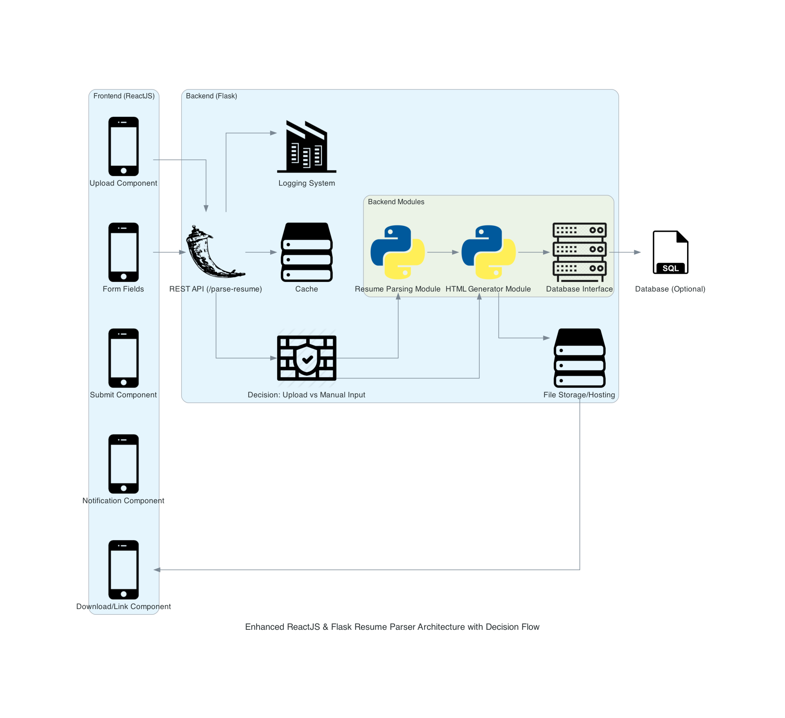

# QuickFolio

Attempt at building a SaaS solution to genearting personal portfolio website. Currently deployed through vercel. Will be developing the backend in the few weeks.

### Stack
- FE: React JS w/ Material UI
- BE: Flask, FastAPI
- DB: MySQL (Undecided)
- Deploy: Heroku & Vercel

## General Overview

### `npm start`

Runs the app in the development mode.\
Open [http://localhost:3000](http://localhost:3000) to view it in your browser.

The page will reload when you make changes.\
You may also see any lint errors in the console.

